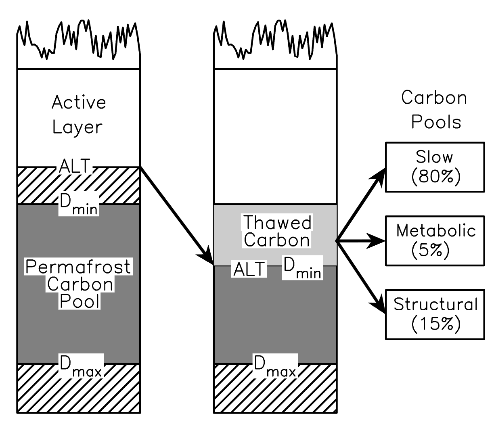

```{r setup}
#| include: false

# Data processing and visualization packages
library(dplyr)
library(tidyr)
library(ggplot2)
theme_set(theme_bw())
library(readr)
library(lubridate)
library(arrow)

# Main analysis packages
library(ranger)
library(vivid)
library(broom)
library(car)
```


## Science question and hypotheses

Permafrost is warming and potentially thawing throughout the
circumpolar boreal and arctic regions.

The resulting increases in the active layer depth should, over
time, put more SOC in play for decomposition: both because of
the warming temperature and the phase change of ice to water.



Uncertainties about post-thaw soil drainage may cause different
amount of CO2 and CH4 to be emitted to the atmosphere from
thawed permafrost.
TODO - cite field/lab experiments showing this

### Hypothesis 1

Accounting for permafrost presence should improve global model performance in predicting soil respiration (annual, annual heterotrophic, and growing season mean).

**This effect will occur for all three observed fluxes.**

How to test: a standard Random Forest model using

- MAT
- MAP
- Clay content
- Land cover
- Permafrost presence (could test SoilGrids gelisols as well as ESA-CCI?)
- MODIS GPP

### Hypothesis 2

Focusing on the permafrost region, thermal state (temperature and 1997-2023 temperature trend) will improve performance against observations, specifically *increasing* predicted respiration (because of more SOC available for decomposition)

**This effect will be occur only for `Rs_growingseason`, i.e. the growing season mean.**

### Hypothesis 3

If H2 is true, this lets us estimate the change in soil-to-atmosphere carbon flux due to permafrost thaw. (Not really a hypothesis.)

## Data sources

### SRDB

In `1-permafrost-rs-prep.qmd` we load the global soil respiration 
database (SRDB) and filter for:

* No experimental manipulation
* No agriculture, bare soil, or urban ecosystem type
* Latitude, longitude, and year of measurement all present
* Either `Rs_annual` or `Rs_growingseason`, or both, is given

This produces a dataset of TODO observations at TODO different sites:

### Permafrost thermal state

The data source for permafrost temperatures is Westermann et al.: 
ESA permafrost Climate Change Initiative (permafrost_cci): 
Permafrost ground temperature for the Northern Hemisphere, v5.0, <https://doi.org/10.5285/5675B0BE944F45A8AF0E7DDBEB47A011>, 2025.

This dataset is derived from the land-surface model CryoGrid 3
([Westermann et al. 2016](https://doi.org/10.5194/gmd-9-523-2016)),
which is driven by time series of air temperature T air, RH, 
wind speed, incoming shortwave and long-wave radiation, air 
pressure, and rates of snowfall and rainfall. 

These data are 1997-2023. The spatial resolution is 0.01°.

For each SRDB observation in that time range, we extract:

* `GST` - Surface temperature
* `GST_uncertainty` - Uncertainty of surface temperature
* `T1m` - Temperature at 1m depth
* `T1m_uncertainty` - Uncertainty of 1m temperature

We also compute, for each geographic point, the 1997-2023 trend
(degC/decade) for the two temperature time series.

### Ancillary data

These include:

* WorldClim data for climatology (air temperature and precipitation), soil type, and land cover (0.5' = ~0.008° resolution)
* ERA5 for 1995-2024 air temperature, soil temperature, precipitation, and soil volumetric water content (~0.08°)
* ERA5 for low and high LAI and soil type (~0.08°)
* MODIS MOD17A2HGF GPP (500m)

All data are ultimately put on the permafrost_cci spatial grid.

## Main dataset

```{r read-data}

dat <- read_parquet("srdb_joined_data.parquet")

message(nrow(dat), " rows of data")

dat |> 
    filter(is.na(Rs_growingseason) | 
             (Rs_growingseason > 0 & Rs_growingseason < 20)) |> 
    filter(is.na(Rs_annual) | 
             (Rs_annual > 0 & Rs_annual < 4000)) |> 
    filter(is.na(Rh_annual) | 
             (Rh_annual > 0 & Rh_annual < 2000)) ->
    dat_filtered

message("After filtering, ", nrow(dat_filtered), " rows of data")
```

### Dependent variable distribution

We have three potential dependent variables:

- `Rs_annual` (annual soil respiration)

- `Rh_annual` (annual heterotrophic respiration)

- `Rs_growingseason` (mean growing season soil respiration)

Their distributions are expected to be non-normal, which is a problem for linear models and not ideal for anything. Evaluate possible transformations.

```{r dv-dist}
#| fig-width: 10
#| fig-height: 8

dat_filtered  |>  
    select(Rs_annual, Rh_annual, Rs_growingseason) |> 
    pivot_longer(everything()) |> 
    filter(!is.na(value), value > 0) |> 
    rename(none = value) |> 
    mutate(log = log(none), sqrt = sqrt(none)) |> 
    
    pivot_longer(-name, names_to = "Transformation") |> 
    ggplot(aes(value, color = Transformation)) + 
    geom_density() +
    facet_wrap(~ name + Transformation, scales = "free")

dat_filtered |> 
    mutate(sqrt_Rs_annual = sqrt(Rs_annual),
           sqrt_Rh_annual = sqrt(Rh_annual),
           sqrt_Rs_growingseason = sqrt(Rs_growingseason)) ->
    dat_filtered
```

**Conclusion: we have a transformation winner: `sqrt()`!**

### Summary

```{r data-summary}

dat_filtered |> 
  select(Year, 
         sqrt_Rs_annual, sqrt_Rh_annual, sqrt_Rs_growingseason,
         PF_GST_mean) |> 
  pivot_longer(starts_with("sqrt")) |> 
  mutate(PF = !is.na(PF_GST_mean)) |> 
  group_by(name, PF) |> 
  summarise(`Years` = paste(min(Year), max(Year), sep = "-"),
            N = n(),
            .groups = "drop") |> 
  knitr::kable()
            
```


## H1: global model test


